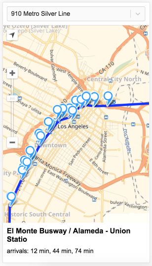

LA Metro Bus & Rail Real-time Arrivals
======

Description
----------------
Here is a mobile-oriented web app that displays the status of the LA Metro Bus lines. Selecting a line show the branches and stops on that line. Selecting a stop show the next 3 departures for that stop.

I used the following technologies and frameworks:
+ Express as a framework for Node.js,
+ Webpack is used as a bandler
+ React, Redux
+ JavaScript API Yandex.Map to embed a map https://tech.yandex.com/maps/jsapi/
+ Jest for unit tests



How to build and start
----------------
Please use Node.js 16.

```bash
npm install
```

Build

```bash
npm run build
```

Run tests

```bash
npm run test
```

Start the server. Server will start on http://localhost:8080

```bash
npm start
```

Resources:

* Realtime API: Returning JSON https://developer.metro.net
